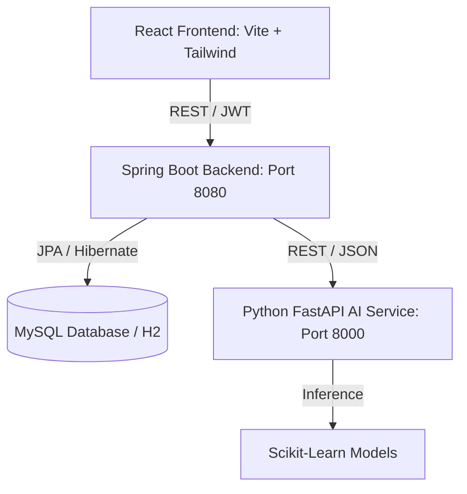

# System Architecture - ResolveAI

ResolveAI is designed as an enterprise-grade customer support triage and ticket resolution platform. It integrates a Java Spring Boot backend, a Python FastAPI AI service, and a React.js client interface.

---

## 1. Architectural Components

### A. React Frontend
- **Framework**: Vite + React.js (JavaScript).
- **Styling**: Tailwind CSS for modern, responsive dashboard elements.
- **Charts**: Recharts.js displaying analytics to managers.
- **Network**: Centralized Axios client integrating JWT interceptors for automatic authentication.

### B. Spring Boot Backend
- **Framework**: Spring Boot 3.3.0, Java 21.
- **Security**: Spring Security + JWT authentication using stateless sessions.
- **Data Access**: Spring Data JPA + Hibernate ORM.
- **Migrations**: Flyway migration scripts initializing tables and seed metadata.

### C. Python AI Service
- **Framework**: Python 3.11, FastAPI, Uvicorn.
- **NLP Models**: 6 scikit-learn models (Category, Intent, Sentiment, Priority, Root Cause, Escalation Risk).
- **Text Vectorization**: TF-IDF (Term Frequency-Inverse Document Frequency) bag-of-words.
- **Serialization**: Joblib serialized model bins.

---

## 2. Core Functional Pipeline

1. **Submission**: A customer logs in and submits a complaint containing a title and description.
2. **Persistence**: The backend saves the complaint under the customer's ID with the status `NEW`.
3. **AI Trigger**: The backend updates the ticket status to `ANALYZING` and makes a synchronous REST request to the Python FastAPI `/api/ai/analyze` endpoint.
4. **NLP Processing**: FastAPI loads the text, vectorizes it, runs model predictions, calculates category probabilities to extract confidence metrics, builds recommended actions, and returns the payload.
5. **Enrichment**: The backend saves the AI predictions in the database, assigns the corresponding category, SLA deadline, and prioritizes the complaint based on predicted levels.
6. **Escalation**: If the escalation risk score is equal to or greater than 80%, the system flags it as `HIGH_RISK` and creates notifications for managers.
7. **Auto-routing**: The backend maps the category to a department, fetches active support agents within that department, sorts them by active workload, and auto-assigns the ticket to the agent with the lowest queue count, updating the ticket state to `ASSIGNED`.

---

## 3. Role-Based Access Control (RBAC)

- **CUSTOMER**: Creates complaints, reviews AI classification status, adds comments, submits satisfaction ratings upon resolution.
- **AGENT**: Reviews assigned complaints, updates status, writes discussion comments, views AI recommendations.
- **MANAGER**: Oversees all complaints, reviews analytics dashboards, manually reassigns tickets, tracks escalated items.
- **ADMIN**: Registers users, configures departments, updates categories, manages recommended solutions and SLA hours.
