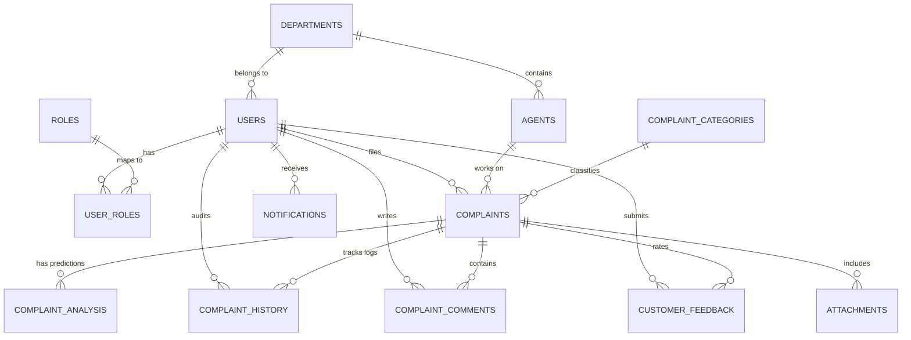

# Database Design and Schema - ResolveAI

The ResolveAI system uses a normalized relational database schema designed for MySQL 8 (production) and H2 in MySQL mode (local testing).

---

## 1. Entity Relationship Layout

---

## 2. Table Schemas

### A. Core Authentication Tables

#### `roles`
Stores role privileges.
- `id` (BIGINT, Primary Key, Auto Increment)
- `name` (VARCHAR(50), Unique, Not Null) - e.g. `ROLE_CUSTOMER`, `ROLE_AGENT`, `ROLE_MANAGER`, `ROLE_ADMIN`

#### `users`
Defines accounts for customers and support staff.
- `id` (BIGINT, Primary Key, Auto Increment)
- `username` (VARCHAR(100), Unique, Not Null)
- `password` (VARCHAR(255), Not Null) - BCrypt encrypted
- `email` (VARCHAR(100), Unique, Not Null)
- `first_name` (VARCHAR(100))
- `last_name` (VARCHAR(100))
- `department_id` (BIGINT, Foreign Key referencing `departments.id`)
- `created_at` (TIMESTAMP)
- `updated_at` (TIMESTAMP)

#### `user_roles`
Join table mapping users to roles.
- `user_id` (BIGINT, Primary Key, Foreign Key referencing `users.id`)
- `role_id` (BIGINT, Primary Key, Foreign Key referencing `roles.id`)

### B. Department & Workload Tables

#### `departments`
- `id` (BIGINT, Primary Key, Auto Increment)
- `name` (VARCHAR(100), Unique, Not Null) - e.g. `Billing & Payments`
- `description` (VARCHAR(255))

#### `agents`
Tracks agent workloads.
- `id` (BIGINT, Primary Key, Auto Increment)
- `user_id` (BIGINT, Unique, Foreign Key referencing `users.id`)
- `department_id` (BIGINT, Foreign Key referencing `departments.id`)
- `status` (VARCHAR(50)) - `AVAILABLE`, `BUSY`, `OFFLINE`
- `max_concurrent_complaints` (INT, Default 5)
- `current_complaints_count` (INT, Default 0)

### C. Complaint & AI Analysis Tables

#### `complaints`
The main support ticket entity.
- `id` (BIGINT, Primary Key, Auto Increment)
- `title` (VARCHAR(255), Not Null)
- `description` (TEXT, Not Null)
- `status` (VARCHAR(50)) - `NEW`, `ANALYZING`, `ASSIGNED`, `IN_PROGRESS`, `WAITING_FOR_CUSTOMER`, `RESOLVED`, `CLOSED`, `ESCALATED`
- `priority` (VARCHAR(50)) - `LOW`, `MEDIUM`, `HIGH`, `CRITICAL`
- `customer_id` (BIGINT, Foreign Key referencing `users.id`)
- `category_id` (BIGINT, Foreign Key referencing `complaint_categories.id`)
- `assigned_agent_id` (BIGINT, Foreign Key referencing `agents.id`)
- `assigned_department_id` (BIGINT, Foreign Key referencing `departments.id`)
- `created_at` (TIMESTAMP)
- `updated_at` (TIMESTAMP)
- `resolved_at` (TIMESTAMP)
- `closed_at` (TIMESTAMP)
- `sla_deadline` (TIMESTAMP)
- `escalation_status` (VARCHAR(50)) - `NONE`, `HIGH_RISK`, `ESCALATED`

#### `complaint_analysis`
Stores the ML model inferences.
- `id` (BIGINT, Primary Key, Auto Increment)
- `complaint_id` (BIGINT, Unique, Foreign Key referencing `complaints.id`)
- `category` (VARCHAR(100))
- `intent` (VARCHAR(100))
- `sentiment` (VARCHAR(100))
- `priority` (VARCHAR(100))
- `escalation_risk` (DOUBLE)
- `root_cause` (VARCHAR(255))
- `confidence_score` (DOUBLE)
- `recommended_actions` (TEXT)

---

## 3. SLA Rules & Knowledge Bases

#### `sla_rules`
Tracks response deadlines.
- `id` (BIGINT, Primary Key, Auto Increment)
- `priority` (VARCHAR(50), Unique)
- `resolution_time_hours` (INT)
- `warning_time_hours` (INT)

#### `recommended_solutions`
Knowledge articles matching predictions.
- `id` (BIGINT, Primary Key, Auto Increment)
- `title` (VARCHAR(255), Not Null)
- `description` (TEXT)
- `category` (VARCHAR(100))
- `intent` (VARCHAR(100))
- `root_cause` (VARCHAR(100))
- `resolution_steps` (TEXT)
